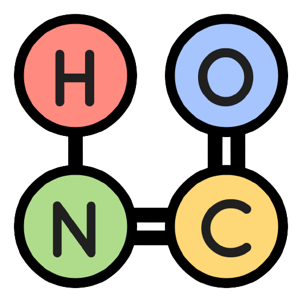

# SokobondSolver 🧙🏾‍♂️
A program that solves Sokobond Puzzle Game Level using A* algorithm. Written in :Java:. More on Sokobond: https://store.steampowered.com/app/290260/Sokobond/
<!-- PROJECT LOGO -->
<br />
<div align="center">
   <a href="https://github.com/moonawar">
    
  </a>
  <h3 align="center">Sokobond Solver 🧙🏾‍♂️</h3>
      
  <p align="center">
     Sokobond Solver is a program written in Java intended to solve sokobond puzzle level. Sokobond is a puzzle game that revolves around the concept of chemical bonding. The game is played in a grid-based area where atoms are scattered throughout the environment. The goal is simple: arrange the atoms in such a way that it satisfies the chemical bonding rules.
  </p>
</div>

## Technology Used
1. [Java Development Kit](https://www.java.com/en/)

## Prerequisite
1. Install [Java 8](https://www.java.com/download/ie_manual.jsp) or later version

## How to Run the App
1. Clone the repository with the following command
```
git clone https://github.com/moonawar/Tubes3_gpt-chan.git
```
2. Enter the cloned repository directory
3. Run the command `cd target` to enter the target directory
4. Run the command `java -jar SokobondSolver.jar`. The program will be up in the terminal if done corretly. 

## Made By
Me, Addin Munawwar
